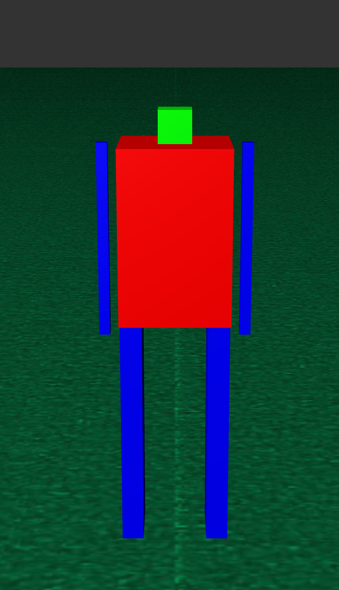
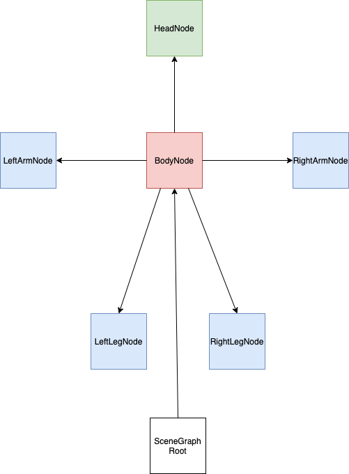

# Scene Graph Activity

So far in your graphics experience you have dealt mostly with simple shapes. For simple scenes with only a few objects, you can get away with having individual objects and calling the draw method for each one. However, as your scenes get more complex this becomes more unmanagable. Take for example the lines you created to draw the net in the PingPong3D homework. To keep these organized you may have decided to use an array or std::vector object to hold them. This simplifies your scene because you do not need to create individual named variables for each line, and you can loop over the array or vector to draw each one. Unfortunately, as scenes get even more complex, linear structures work less effectively to keep track of all the objects in the scene.

You need some way to keep track of the transformations for each object. For example if you were going to draw a car, you might create a 3D model for the body of the car and use a cylinder for each wheel. Notice, that if you want to then move the car, you would need to update the positions of all the wheel cylinders and the body. Quickly your code is going to look pretty aweful.

### Local Transformations

Luckly, what you actually care about when positioning the wheels on the car is the local transformation between each wheel and the car’s body position. A scene graph helps with this by organizing all the objects in a scene into a graph data structure. Each node in the graph can store the transformation matrix for a piece of geometry relative to its parent in the graph.

Now, assuming the wheel objects of your car are children of the car body, all you need to do to move the full car is move the body. The wheels will follow along since their transformations are relative to it.

### Node Types and Drawing

To draw a scene graph all you need to do is a graph traversal, drawing the geometry for each node as you traverse the graph based on the node’s local transformation multiplied with the accumulated parent’s transformation.

A scene node doesn’t necessarily have to contain graphical information, such as a 3D model. They may be purely transitional, that is, nodes that group together and translate/rotate a number of children, but don’t render anything themselves. For example, perhaps the axles of the car are a transition node, with the wheels as children. Then, we only have to rotate the axle to rotate both wheels.

In this activity, you will practice creating a scene graph structure to organize drawing a more complex shape, the box robot.

## Getting Started

Clone and generate the project files using cmake as usual. Explore the starter code, paying particular attention to the SceneNode class. This will be used to represent a node in the scene graph.

## To Do

Your task is to create a scene graph to draw a boxy robot.

Inside onRenderGraphicsContext() create the scene graph by creating box objects to represent the body, head, arm and leg. Then create SceneNode objects to hold each of the boxes with appropriate transformations to draw them at the correct positions. Link the scene nodes by calling the AddChild method to create the following structure:

The robot has a transitional scene node, i.e. without geometry as its root node. This is to make it easier to place the robot in the world; if we place an instance of the robot at the origin, we really want it to be centered, standing on the origin, so the origin is between its legs. The transitonal scene node is already created for you, called sceneGraphRoot. The sceneGraphRoot node should have one child, the robot’s body. This body node has five children, the arms, the legs, and the head.
